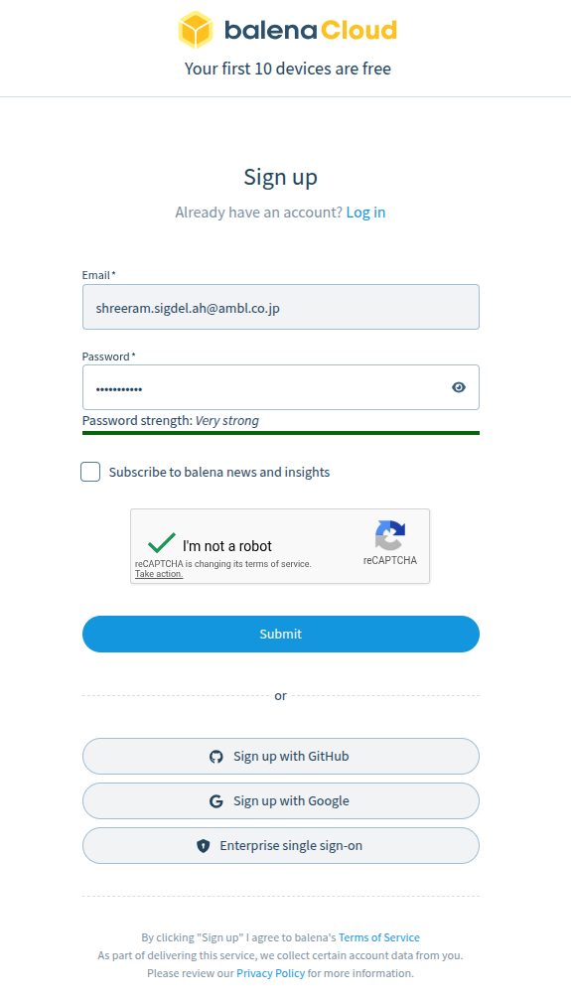
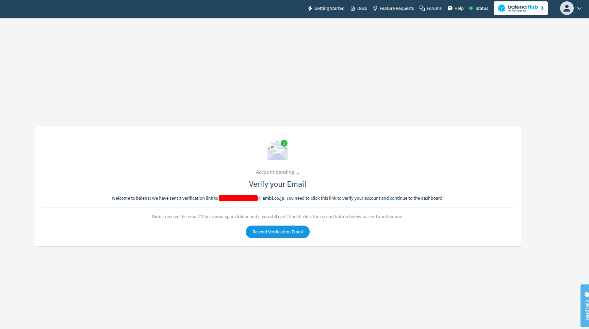
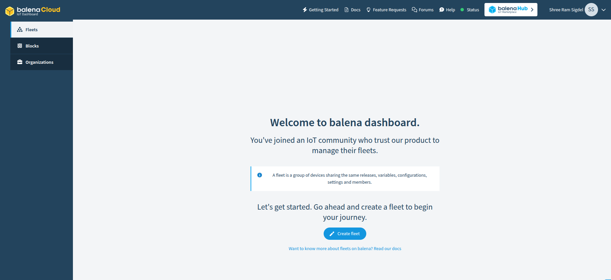

# Sign Up for balenaCloud

## 1. Open the balenaCloud Login Page

Go to [balenaCloud Login](https://dashboard.balena-cloud.com/login).

> The first 10 devices are free.

## 2. Create an Account

Sign up using your email address or one of the available sign-in methods (GitHub, Google, etc.).

## 3. Verify Your Email Address

Check your inbox and complete the email verification process.

## 4. Access the balenaCloud Dashboard

After verification, log in to the balenaCloud dashboard to continue.

