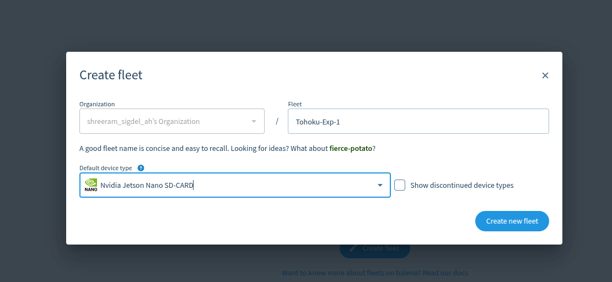
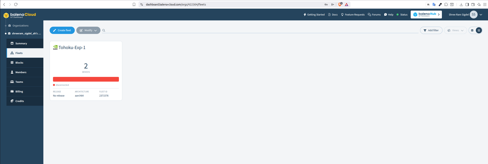

# Create a Fleet in balenaCloud

## What is a Fleet?

A **Fleet** is a group of devices managed together in balenaCloud.

Think of a Fleet as a project or application workspace. Devices that belong to the same Fleet receive the same application updates, configuration settings, and monitoring capabilities.

For example:

- Fleet: `smart-camera`
  - Jetson Nano #1
  - Jetson Nano #2
  - Raspberry Pi 5 #1

All devices in the Fleet can be managed from a single dashboard.

### Benefits of Using a Fleet

- Centralized device management
- Remote application deployment
- Over-the-air (OTA) updates
- Device monitoring and troubleshooting
- Configuration management through environment variables

---

## Create a New Fleet

### 1. Log in to balenaCloud

Open:

https://dashboard.balena-cloud.com/

and sign in to your account.

---

### 2. Click **Create Fleet**

From the dashboard, click the **Create Fleet** button.

---

### 3. Enter Fleet Information

Configure the Fleet settings:

- **Fleet Name**: A unique name for your project
- **Device Type**: Select your target hardware
  - Raspberry Pi 5
  - Jetson Nano
  - Jetson Orin
  - Other supported devices

Example:

- Fleet Name: `Tohoku-Exp-1`
- Device Type: `Jetson Nano`

---

### 4. Create the Fleet

Click **Create Fleet**.

balenaCloud will create a new Fleet and redirect you to the Fleet dashboard.

---

## Fleet Dashboard Overview

The Fleet dashboard provides:

- Device list
- Application deployments
- Environment variables
- Logs and monitoring
- Remote terminal access
- Device health information

From this dashboard, you can add devices, deploy applications, and manage your entire edge environment.

---

## Next Step

After creating a Fleet, the next step is to add a device and download the balenaOS image for that device.
