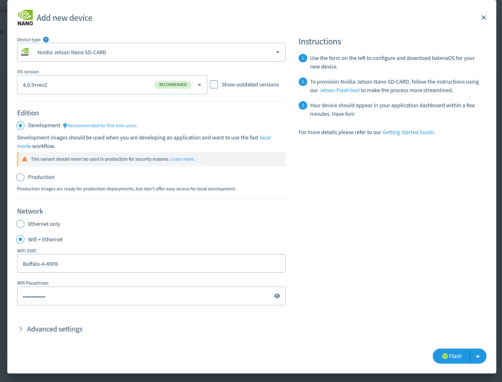
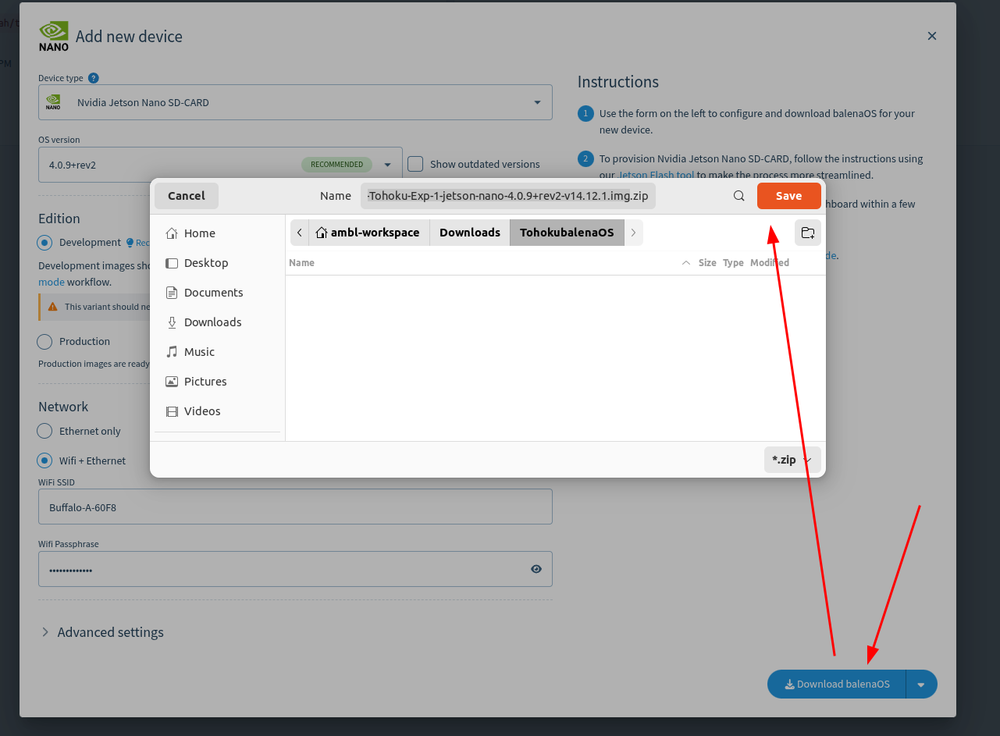

# Add a Device to a Fleet

After creating a Fleet, the next step is to add a device. Adding a device allows balenaCloud to generate a customized balenaOS image that automatically connects to your Fleet when the device boots.

---

## What Happens When You Add a Device?

When a device is added:

- balenaCloud generates a device-specific balenaOS image.
- The image contains the Fleet information and connection settings.
- Once the device boots with this image, it automatically registers itself to the Fleet.
- The device can then be monitored and managed remotely through balenaCloud.

---

## 1. Open Your Fleet

From the balenaCloud dashboard, select the Fleet you created earlier.

---

## 2. Click **Add Device**

Inside the Fleet dashboard, click the **Add Device** button.

---

## 3. Configure Device Settings

Select the appropriate options for your hardware.

### Device Type

Choose the device you want to register.

Examples:

- Raspberry Pi 5
- Jetson Nano Developer Kit
- Jetson Orin Nano
- Jetson Orin NX

### balenaOS Version

Select the recommended or required balenaOS version.

### Network Connection

Configure the network settings if needed:

- Wi-Fi SSID
- Wi-Fi Password

> If using Ethernet, Wi-Fi settings can be skipped.

### Advanced Options (Optional)

Additional settings such as hostname or network configuration can be customized if required.

---

## 4. Download balenaOS

After completing the configuration, click **Download balenaOS**.

balenaCloud will generate a customized operating system image for the selected device.

---

## Result

You should now have a balenaOS image file ready to be flashed onto the target device.

## Next Step

Proceed to:

➡️ [Flash balenaOS to a Device](#flash-balenaos-to-a-device)

The downloaded balenaOS image must be flashed to the target device before it can connect to balenaCloud.

