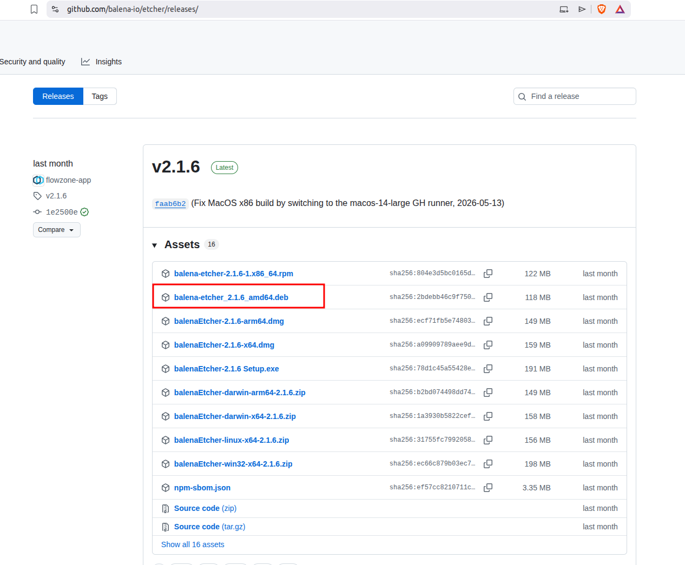

# Flash balenaOS to a Device

After downloading the balenaOS image, it must be written to the device's storage media before booting.

## Tested Platform

- Ubuntu 22.04 LTS (Jammy) x86_64

## 1. Install Balena Etcher

Download the latest Etcher package from:

https://etcher.balena.io/

Install the downloaded package:
[For Debian and Ubuntu GitHub.. ](https://github.com/balena-io/etcher#debian-and-ubuntu-based-package-repository-gnulinux-x86x64)

You can directly skip above contents and directly visit the given link to download the Etcher Tool.
[Etcher Download Page](https://github.com/balena-io/etcher/releases/)



To install in UBUNTU:

```bash
sudo apt install ./balena-etcher_<version>_amd64.deb
```

For  2.1.6 verison: Note: Fix the path

```bash
sudo apt install ./balena-etcher_2.1.6_amd64.deb
```

Launch Balena Etcher 

```
balena-etcher
```

Alternatively, launch Etcher from the Ubuntu application menu.


