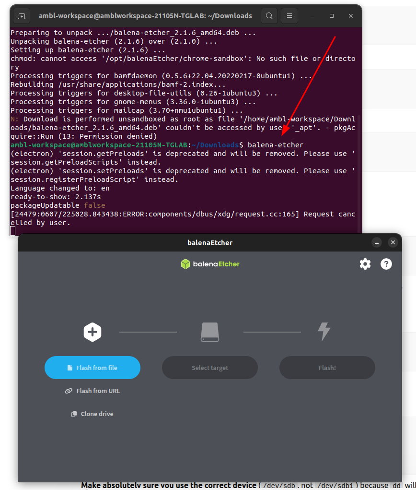
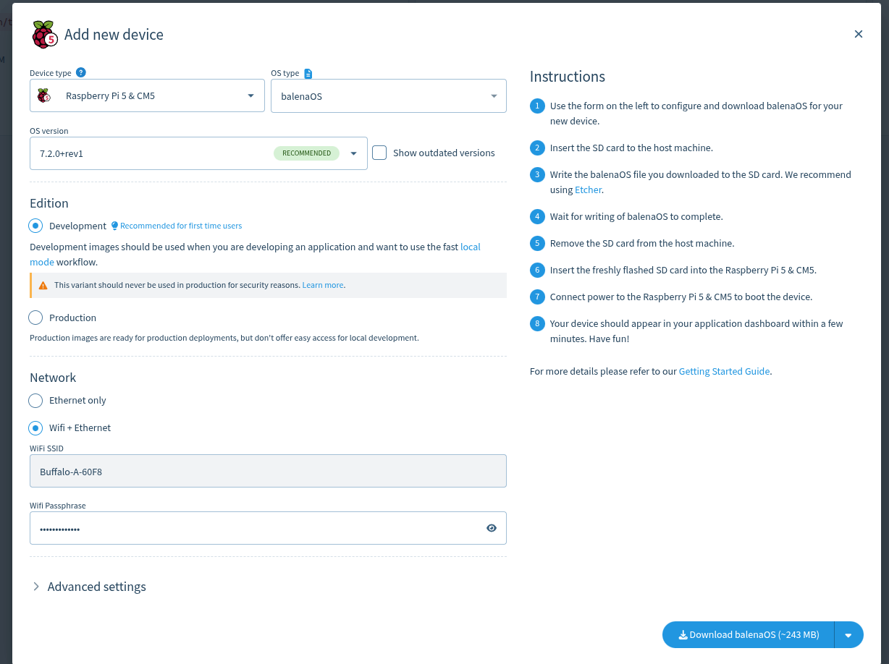
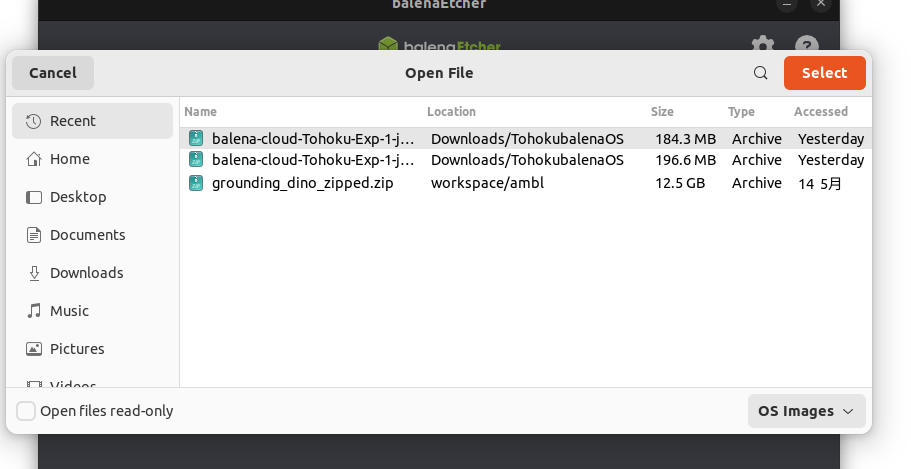
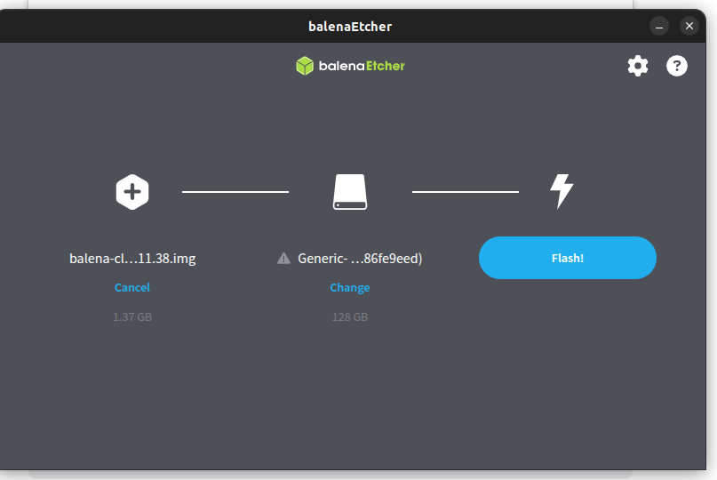
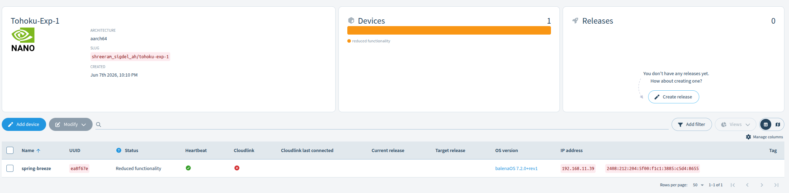

# Flash balenaOS to Raspberry Pi 5

After downloading the customized balenaOS image from balenaCloud, the image must be flashed to a MicroSD card before booting the Raspberry Pi 5.

## Prerequisites

Before proceeding, ensure that:

- A Fleet has been created in balenaCloud.
- A Raspberry Pi 5 device has been added to the Fleet.
- The balenaOS image has been downloaded.
- Balena Etcher is installed on the host machine.
- A MicroSD card is available.

---

## 1. Insert the MicroSD Card

Insert the MicroSD card into your computer using a card reader.

Verify that the card is detected by the operating system.

---

## 2. Launch Balena Etcher

Open Balena Etcher.

---

## 3. Download and Select the balenaOS Image

Click **Flash from File**.

Select the balenaOS image downloaded from balenaCloud.

---

## 4. Select the Target Drive

Click **Select Target**.

Choose the MicroSD card that will be used in the Raspberry Pi 5.

⚠️ Ensure the correct drive is selected to avoid overwriting other storage devices.

---

## 5. Start Flashing

Click **Flash**.

Balena Etcher will:

- Write the balenaOS image to the MicroSD card.
- Verify the flashed image automatically.

Wait until the process completes successfully.

---

## 6. Safely Remove the MicroSD Card

After the flashing process completes:

1. Close Balena Etcher.
2. Safely eject the MicroSD card.
3. Remove the card from the card reader.

---

## 7. Insert the MicroSD Card into the Raspberry Pi 5

Insert the flashed MicroSD card into the Raspberry Pi 5.

---

## 8. Connect Network and Power

Connect:

- Ethernet cable (recommended for first boot)
  or
- Wi-Fi (if configured during device setup)

Then connect the USB-C power supply.

---

## 9. Wait for Device Registration

During the first boot:

- balenaOS initializes the device.
- Network connectivity is established.
- The device automatically connects to balenaCloud.
- The device registers itself with the configured Fleet.

> The first boot may take several minutes.

---

## 10. Verify Device Status

Open the balenaCloud dashboard and navigate to your Fleet.

Once the Raspberry Pi 5 successfully connects, its status will change to:

**Online**

---

## Result

The Raspberry Pi 5 is now connected to balenaCloud and ready for application deployment.

## Next Step

➡️ Deploy an application to the Fleet and verify that it runs successfully on the Raspberry Pi 5.

You can complete additional task like remote reboot, verification of dashboard various element. 