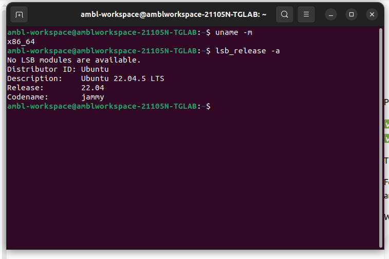
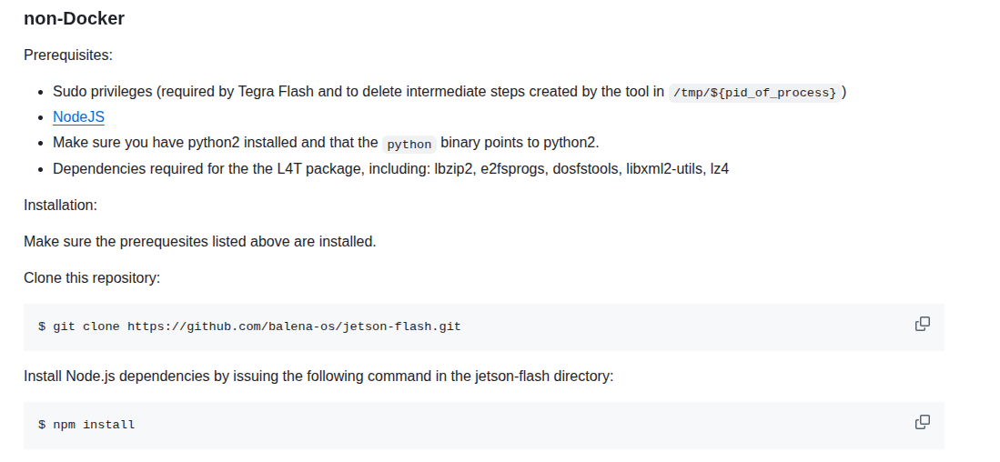
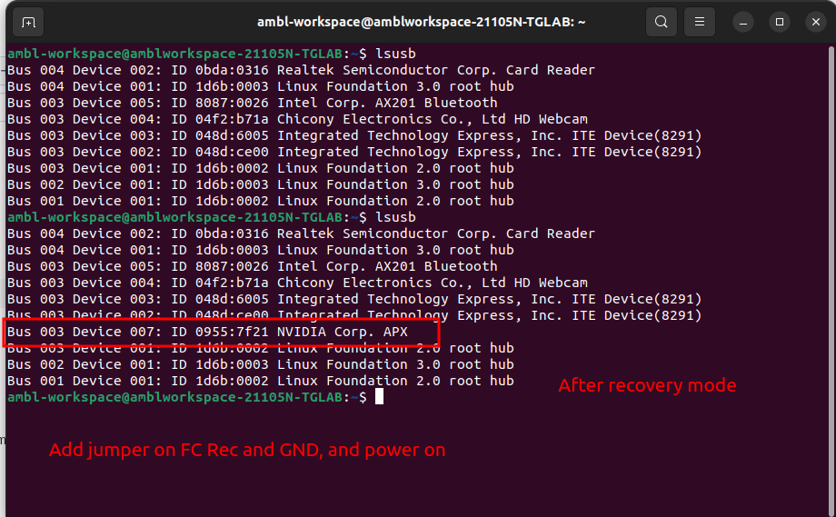
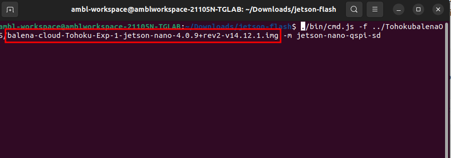
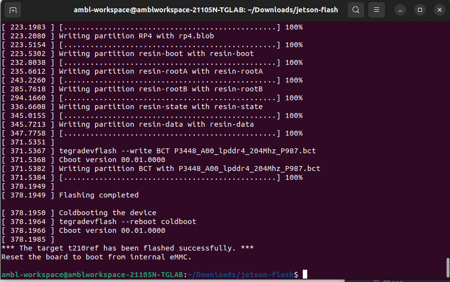
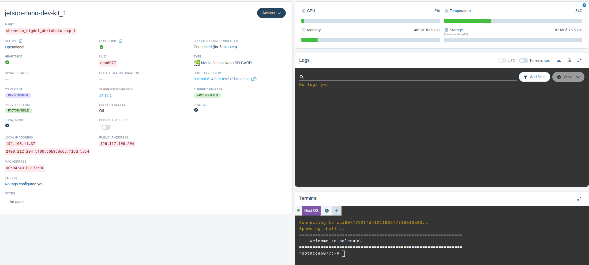

:Jetson Nano Device info (before installing or reseting the nvidia sdk)

* **Jetson Nano 4GB Developer Kit B01** (`tegra210-p3448-0000-p3449-0000-b00.dts`)
* **microSD version**

  Note: Please check version of Rasberry Pi5 (a lot of contents are similar)  For jetson nano recoverymode is very important



---

# Option 1 (Recommended): balenaEtcher

### 1. Create a fleet

In balenaCloud:

* Create Fleet
* Device type:

```text
Jetson Nano SD-CARD
```

* Add Device
* Development image
* Download the `.img.zip`

---

### 2. Flash the SD card

Using balenaEtcher:

1. Select the downloaded image.
2. Select the microSD card.
3. Flash.

011---

### 3. Boot the Nano

Insert the card and power on.

After a couple of minutes, the device should appear online in balenaCloud.

---

# If it DOESN'T boot (For jetson nano developer kit, I had to get into recovery mode)

Then you may need to update the QSPI bootloader using `jetson-flash.sh`.

## On your Ubuntu host (Ubunut 22.04 LST (Jammy) Tested Environment)

You can use docker to install as well but In my case I used Host machine i,e ubunut 22.04

Install balena CLI:

```bash
sudo npm install -g balena-cli
```

Login:

```bash
balena login
```

Clone jetson-flash:

```bash
git clone https://github.com/balena-os/jetson-flash.git
cd jetson-flash
```

  (source [official document)](https://github.com/balena-os/jetson-flash/blob/master/docs/jetson-nano.md) If you have already installed the npm no need to install once again

---

## Put Nano into recovery mode

Power off.

Short:

```
FC REC ↔ GND
```

on the J40 header.

Connect the micro-USB cable to your Ubuntu PC.

Apply power.

Verify:015

```bash
lsusb
```

You should see something similar to:

```text
NVIDIA Corp. APX
```



---

## Download the balenaOS image (Check rasberry pi verison for full details)

From your fleet, download the image and unzip:

```bash
unzip balena-myfleet-jetson-nano.img.zip
```

---

## Flash QSPI

Run:
Recommended Dependencies to install

```bash
sudo apt install -y
  libxml2-utils
  lbzip2
  e2fsprogs
  dosfstools
  lz4
```

Note: Unzip the image file ( I made this common mistake and used some time to dig the error)


```bash
sudo ./bin/cmd.js -f ../TohokubalenaOS/balena-cloud-Tohoku-Exp-1-jetson-nano-4.0.9+rev2-v14.12.1.img -m jetson-nano-qspi-sd
```

The flashing process may take 5 - 15 minutes or longer during which a lot of log output will appear. If all goes well, you'll see something similar to the following upon completion:



Now do this:

1. Power off Jetson Nano.
2. Remove the recovery jumper.
3. Keep the SD card inserted.
4. Power on normally.

Then wait a bit and check  **balenaCloud dashboard** . The device should appear online if the image/config/network is correct.

---

## Note about writing the image to the SD card

 With Etcher... (this part is bit unclear please comment if you find any dissimilarities)
 I did use Etcher to write in SD card but forgot I did it before the recoverymode or after recovery mode.

---

There were few errors, but I have no logs (used Chatgpt for solution)



